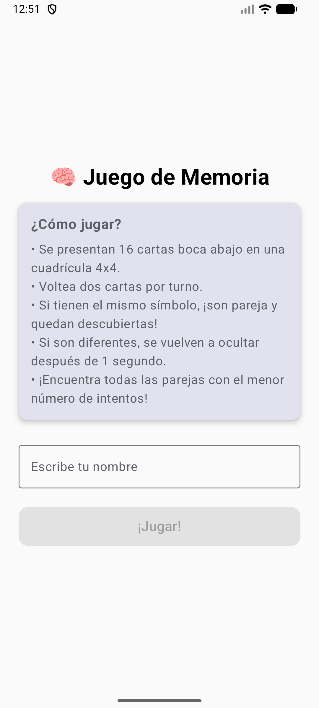
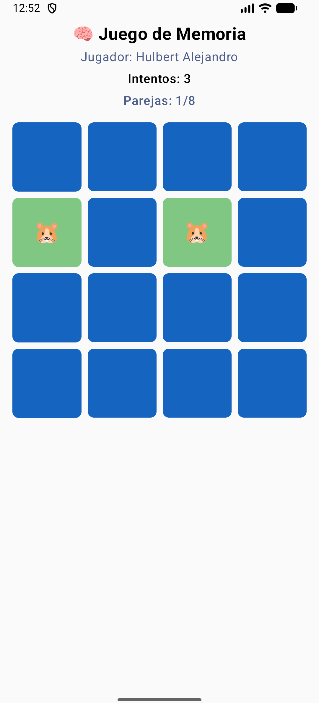

# 🧠 Juego de Memoria - JuegoMemoria

Aplicación móvil desarrollada en **Kotlin** con **Jetpack Compose** como proyecto académico para la materia de desarrollo móvil en la **Universidad del Quindío**.

---

## 📱 Descripción

JuegoMemoria es un juego clásico de memoria donde el jugador debe encontrar todas las parejas de cartas ocultas en un tablero de 4x4. La aplicación cuenta con tres pantallas: inicio, juego y resultados.

---

## 🎮 ¿Cómo jugar?

- Se presentan **16 cartas boca abajo** en una cuadrícula 4x4.
- El jugador voltea **dos cartas por turno**.
- Si ambas cartas tienen el **mismo símbolo**, permanecen descubiertas.
- Si son **diferentes**, se vuelven a ocultar después de 1 segundo.
- El juego termina cuando se encuentran **todas las parejas**.
- El objetivo es completar el tablero con el **menor número de intentos**.

---

## 🗂️ Estructura del proyecto
```
uniquindio.edu.co.juegomemoria/
│
├── model/
│   └── Card.kt                  # Modelo de datos de cada carta
│
├── viewmodel/
│   └── GameViewModel.kt         # Lógica del juego y gestión del estado
│
├── ui/screens/
│   ├── HomeScreen.kt            # Pantalla de inicio
│   ├── GameScreen.kt            # Pantalla del juego
│   └── ResultScreen.kt          # Pantalla de resultados
│
├── navigation/
│   └── AppNavigation.kt         # Configuración de navegación
│
└── MainActivity.kt              # Actividad principal
```

---

## 🛠️ Tecnologías utilizadas

- **Kotlin**
- **Jetpack Compose** - UI declarativa
- **Navigation Compose** - Navegación entre pantallas
- **ViewModel** - Gestión del estado
- **StateFlow** - Flujo reactivo de datos
- **Coroutines** - Manejo del retardo entre cartas

---

## 📋 Requisitos

- Android Studio Hedgehog o superior
- SDK mínimo: API 24 (Android 7.0)
- SDK objetivo: API 36

---

## 🚀 Instalación

1. Clona el repositorio:
```bash
git clone https://github.com/tu-usuario/JuegoMemoria.git
```
2. Abre el proyecto en **Android Studio**
3. Sincroniza las dependencias con **Sync Now**
4. Corre el proyecto en un emulador o dispositivo físico con ▶️

---

## 📸 Pantallas

| Inicio | Juego | Resultados |
|--------|-------|------------|
|  |  |  |

---

## 🤖 Reflexión sobre el uso de la IA

### ¿Qué prompts utilizó para solicitar ayuda a la IA?
- *"Dime paso a paso qué tengo que hacer para desarrollar el juego de memoria en Kotlin con Jetpack Compose"*
- *"Dame el código del GameViewModel con la lógica del juego"*
- *"Me sale este error en el build.gradle, cómo lo soluciono"*

### ¿Qué sugerencias de la IA fueron útiles?
- La estructura del proyecto y organización de paquetes
- El uso de `StateFlow` y `ViewModel` para gestión del estado
- La implementación del retardo de 1 segundo con `delay()` en coroutines
- La animación de volteo de cartas con `animateFloatAsState`

### ¿Qué aspectos del código tuvo que corregir manualmente?
- Ajuste de versiones en `build.gradle.kts` y `libs.versions.toml`
- Corrección de la sintaxis de `compileSdk` para AGP 9
- Reemplazo de `kotlinOptions` por `kotlin { compilerOptions {} }`

### ¿Qué aprendió del proceso de trabajar con IA?
- La IA es una herramienta de apoyo, no un reemplazo del criterio del desarrollador
- Es importante entender el código generado antes de usarlo
- Los errores de configuración requieren contexto específico del proyecto
- La IA puede sugerir versiones desactualizadas que hay que verificar

### ¿Qué errores aparecieron y cómo los solucionó?
| Error | Solución |
|-------|----------|
| `Unresolved reference kotlin.android` | Eliminar el plugin por incompatibilidad con AGP 9 |
| `kotlinOptions unresolved` | Reemplazar por `kotlin { compilerOptions {} }` |
| `compileSdk` con sintaxis incorrecta | Usar `compileSdk = 36` en lugar de la sintaxis de bloque |
| Dependencias requieren API 36 | Actualizar `compileSdk` y `targetSdk` a 36 |

---

## 👨‍💻 Autor

**Julian Ladino**  
Universidad del Quindío  
Ingeniería de Sistemas

---

## 📄 Licencia

Este proyecto es de uso académico.